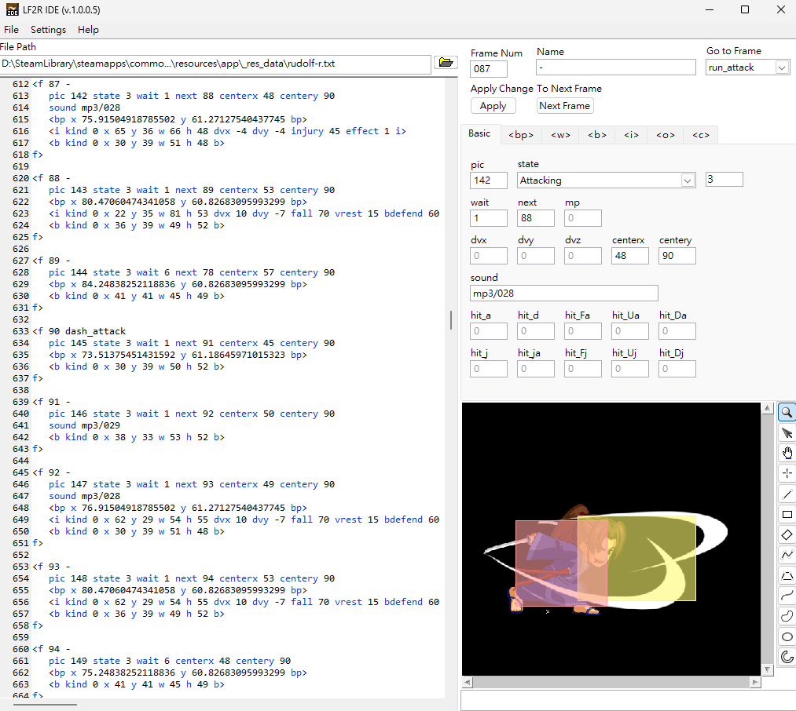

 
LF2R IDE  
 
 
 

==============================================================
Little Figther 2 Remastered Integrated Development Environment

LF2R IDE is a graphical file editor designed for Little Fighter 2 Remastered. It allows users to easily edit *-r.txt data files with user-friendly features, streamlining the modding process for creators.

Features
--------------------------------------------------------------
- File editor with syntax highlighting
- Graphical editing environment
- Quick navigation to action tags
- Frame picture display
- Hitbox and point position display

Downloads
--------------------------------------------------------------
Visit the [Releases](https://github.com/Eremes1641/LF2R-IDE/releases) page to download the latest version.

License
--------------------------------------------------------------
LF2R IDE is licensed under the [MIT License](https://github.com/Eremes1641/LF2R-IDE/blob/main/LICENSE).
